# Training: DQN & PPO
We tried both DQN and PPO as reinforcement learning algorithms to train our model. DQN is a value-based method, while PPO is an actor-critic method. This first round of experimentation focused on tuning the DQN setup before comparing it against PPO.

# DQN
## First Round
In the first experimentation round, we trained DQN under several different hyperparameter settings and compared the episode returns over 600 episodes. The baseline configuration was:

- `discount = 0.99`
- `learning_rate = 0.001`
- `buffer_size = 100000`
- `batch_size = 64`
- `target_update_freq = 1000`
- `epsilon_start = 1.0`
- `epsilon_min = 0.01`
- `epsilon_decay = 0.99999`

The goal of this round was not only to find the single best-performing configuration, but also to understand which hyperparameters had the largest effect on training stability and final return.

## Exploration Schedule Experiment
The first comparison tested two exploration schedules: an episodic schedule and a step-based schedule. The episodic schedule produced much more stable returns, staying mostly within a consistent reward range throughout training. In contrast, the step schedule initially achieved very high returns, but later collapsed and remained much lower for the rest of training. This result suggests that the step schedule encouraged too much early exploitation or changed exploration too aggressively. Even though it had a higher peak reward, it was not reliable. The episodic schedule was therefore the stronger choice for continued experiments because it maintained consistent performance across the full training run.

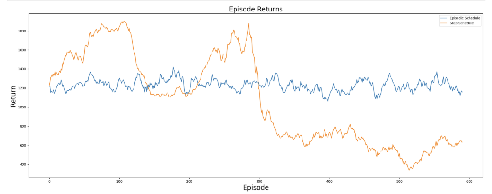

## Learning Rate Experiment
We next compared learning rates of `0.001`, `0.0001`, and `1e-06`. Overall, the learning-rate experiment showed little separation between the three settings. All three curves stayed in a similar return range and fluctuated throughout training without a clear long-term upward or downward trend.
The main takeaway is that the model was not extremely sensitive to learning rate within this range. The baseline value, `0.001`, remained a reasonable choice because it performed well and reached some of the highest returns, while not showing clear instability compared to the smaller learning rates.

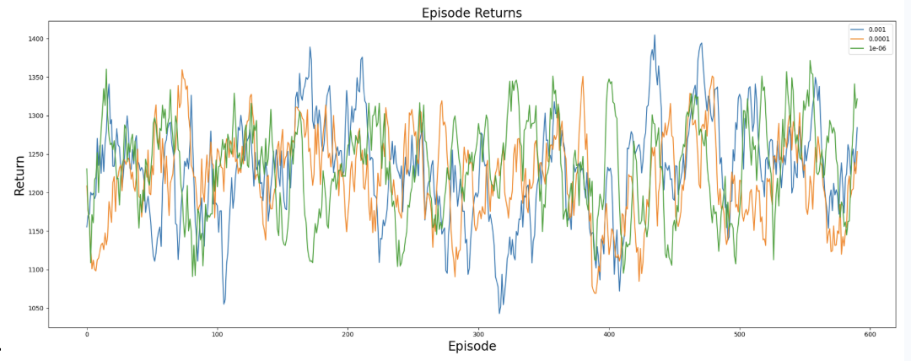

## Discount Factor Experiment
We also tested discount factors of `0.9`, `0.95`, and `0.99`. These settings again produced similar behavior, with all three returns fluctuating with the same general range and cyclicality. No discount factor dominated across the entire run.
However, since the bus-routing task depends on route-level outcomes rather than only immediate rewards, a higher discount factor is still preferable. The baseline value of `0.99` allows the agent to value longer-term consequences of routing decisions, so we kept it for the next stage.

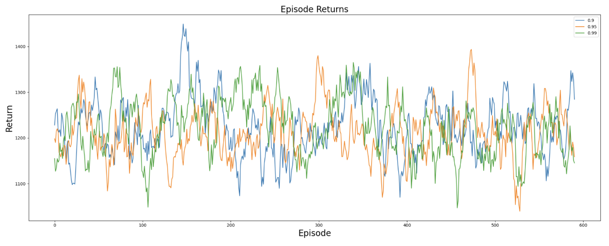

## Epsilon Decay Experiment
The epsilon decay experiment had the clearest impact on performance. We compared `0.999`, `0.9999`, and `0.99999`. The fastest decay, `0.999`, reached high returns at first, but then dropped and continued declining. This result indicates that the agent reduced exploration too soon and converged toward a poor policy.
The slower decay rates were much more stable. In particular, `0.99999` maintained stronger returns over time and avoided the collapse seen with `0.999`. Because of this trait, the baseline epsilon decay of `0.99999` was the best option from this experiment.

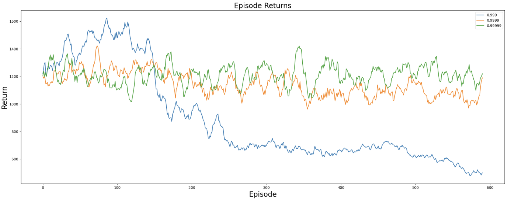

## Optimizer Experiment
Finally, we compared AdamW, Adam, and RMSprop. The optimizer experiment showed only small differences between the three optimizers; all three had similar levels of fluctuation and remained in a comparable reward range.
Adam had a slight edge because it achieved the highest *maximum* reward during the run. However, the difference was not significant enough to make Adam the undisputed best selection. The takeaway is that optimizer choice mattered less than the exploration settings, especially epsilon decay.

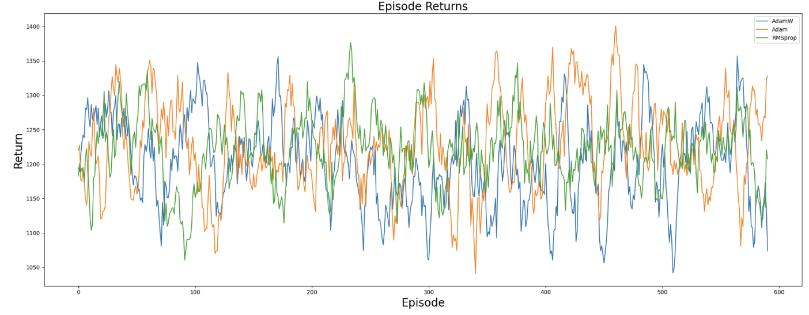

### First-Round Takeaways
The most important result from the first experimentation round was that exploration strategy had the largest effect on DQN performance. The step-based exploration schedule and the faster epsilon decay setting both produced strong early rewards but later collapsed, which made them unreliable for continued training.
Overall, the first round makes clear that stable long-term exploration is more important than chasing the highest early reward. The strongest DQN configuration was the one that avoided collapse and maintained consistent returns across training.

## Second Round
In the second experimentation round, we continued tuning the DQN model using the results from the first round as a guide. Based on the earlier experiments, we used Adam as a safe optimizer choice and kept the episodic epsilon update schedule because it was more stable than the step-based schedule. We also added two new experiments in this round: buffer size and batch size.

The baseline configuration for this round was:

- `discount = 0.95`
- `learning_rate = 0.001`
- `buffer_size = 100000`
- `batch_size = 64`
- `target_update_freq = 1000`
- `epsilon_start = 1.0`
- `epsilon_min = 0.01`
- `epsilon_decay = 0.99999`
- Adam optimizer
- Episodic epsilon update

Compared to the first round, the main baseline change was lowering the discount factor from `0.99` to `0.95`. This change made the agent focus less on very long-term rewards while still valuing future route outcomes.

## Exploration Schedule Experiment
We again compared the episodic epsilon schedule against the step-based schedule. This time, the step schedule performed much better than it did in the first round. After an unstable middle section, it recovered well and proceeded to reach the highest returns in the round. The episodic schedule stayed much more consistent, remaining close to the same return range across training, albeit a low one.

Although the step schedule achieved the best final and maximum rewards, it was also less stable. It is hard to trust that over a longer training period, it would be just as stable. So, the episodic schedule was still the safer option because it avoided the large swings seen in the step schedule.

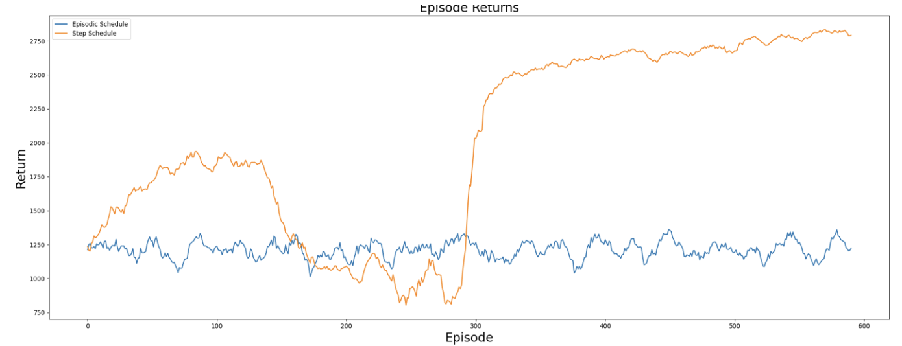

## Learning Rate Experiment
The learning rate experiment compared `0.001`, `0.0001`, and `1e-06`. Similar to the first round, the three learning rates produced very similar behavior. The return curves overlapped for most of the run, and none of the settings outperformed the others over the full 600 episodes.

The baseline learning rate of `0.001` remained a strong choice because it reached competitive peak returns without creating worse instability than the smaller learning rates.

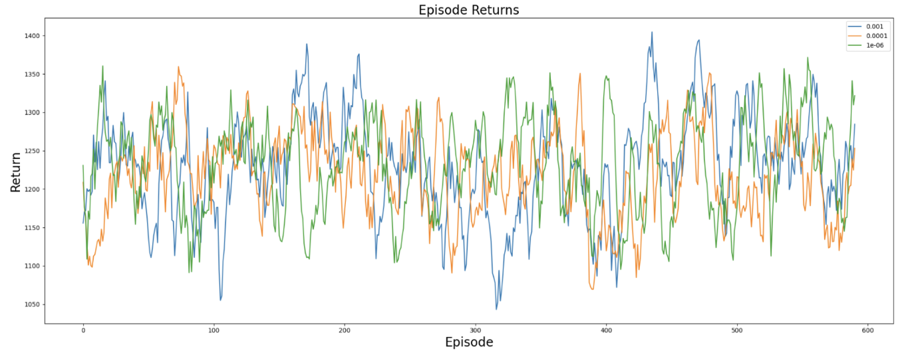

## Discount Factor Experiment
We compared discount factors of `0.9`, `0.95`, and `0.99`. The results were again close, with all three settings fluctuating in a similar reward range. We chose `0.95` as the baseline because it provided a balance between immediate routing rewards and longer-term consequences.

A discount factor of `0.99` still makes sense for tasks with long-term planning, but the second round did not show a clear advantage from using the highest discount value. Since `0.95` performed competitively and may reduce overemphasis on distant rewards, it was a reasonable setting to keep.

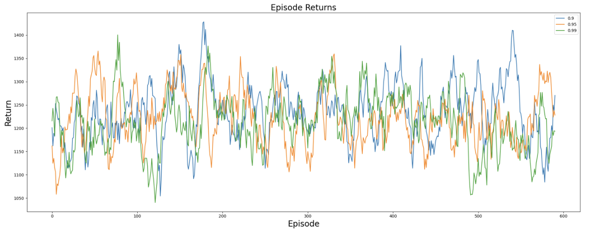

## Epsilon Decay Experiment
In the second round, we compared epsilon decay values of `0.999`, `0.9999`, and `0.99999`. The fastest decay, `0.999`, was again unstable. It reached high returns early, dropped for a long period, recovered, and then declined near the end. These moves confirmed the first-round observation that decaying epsilon too quickly can cause unstable learning and poor final performance.

The slower decay values, `0.9999` and `0.99999`, were much more reliable. They stayed in a tighter return range and avoided the severe collapse seen with `0.999`. Because of this, `0.99999` remained the best default epsilon decay setting, especially when prioritizing consistency over short-term spikes.

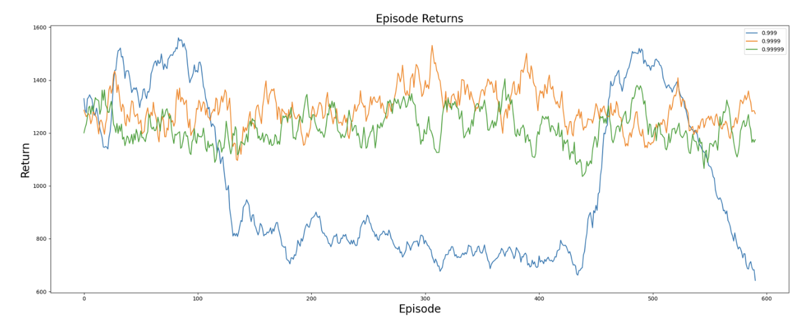

## Optimizer Experiment
We compared AdamW, Adam, and RMSprop again. The optimizer experiment showed little separation between the three options. All three optimizers stayed within a similar range and showed comparable fluctuation across training.

Adam remained a safe choice because it performed well and did not show any major instability. Even though the optimizer curves were close, Adam is a reasonable default because it produced strong results in both experimentation rounds and did not appear to be a limiting factor.

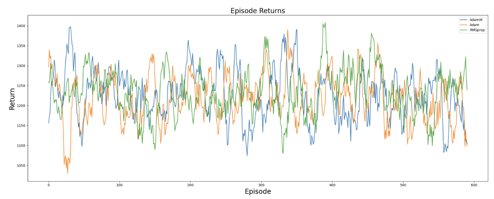

## Buffer Size Experiment
As mentioned above, we tinkered with buffer size and batch size during this round.
We compared the values `100000`, `500000`, and `1000000`. The results showed that buffer size did not cause a significant change to the overall return range. All three buffer sizes fluctuated over time and produced comparable performance.

The baseline buffer size of `100000` remained acceptable because increasing the replay buffer did not yield significant return improvements. Larger buffers may preserve more past experience, but they also include older transitions that may be less useful as the policy changes.

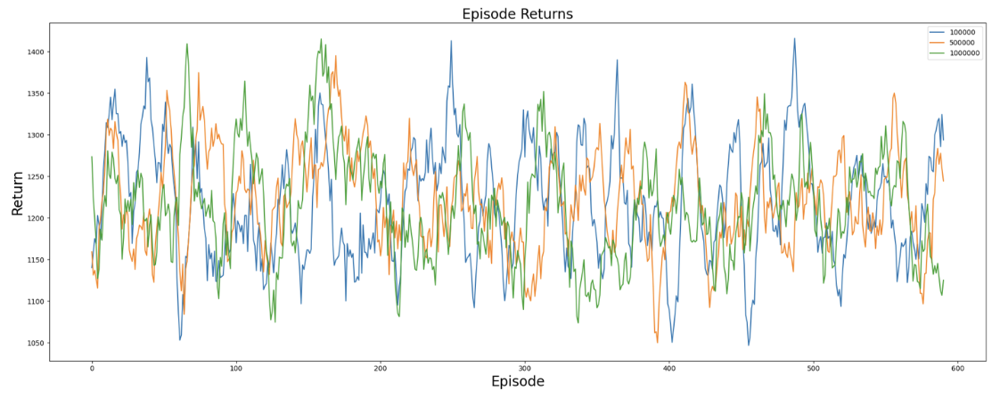

## Batch Size Experiment
We compared batch sizes of `32`, `64`, and `128`. The batch size experiment showed no clear winner. All three settings had similar variability, and each produced periods of both stronger and weaker performance.

The baseline batch size of `128` is a good choice. It has peaks and troughs in line with the other two, but its peaks tend to hit higher than its peers. 

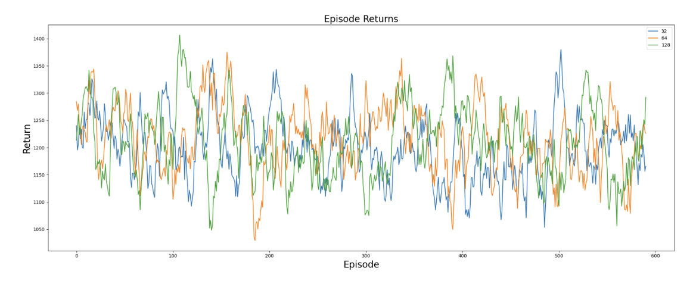

### Second-Round Takeaways
The second round confirmed several patterns from the first round. Learning rate, discount factor, optimizer, buffer size, and batch size all had small effects compared to the exploration settings. The most important hyperparameter remained epsilon behavior.

The clearest negative result was again the fast epsilon decay value of `0.999`, which created unstable learning and poor final returns. The slower decay values were much more reliable. The step-based epsilon schedule showed outstanding upside in this round, but it was still less stable than the episodic schedule.

Overall, the second round supports the following DQN configuration for continued testing:

- episodic epsilon update
- Adam optimizer
- `learning_rate = 0.001`
- `discount = 0.95`
- `buffer_size = 100000`
- `batch_size = 128`
- `epsilon_decay = 0.99999`

The main conclusion is that DQN performance is most sensitive to exploration control. Stable exploration produced more dependable training, while aggressive decay or unstable schedules could yield high peaks but also large collapses.

# PPO